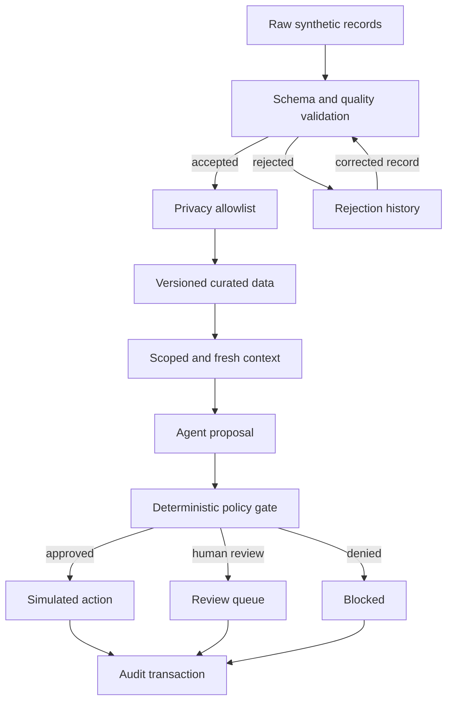

# Trusted Agent Data Plane

A local reference implementation for validating, governing and auditing the data and actions used by AI agents.

**The agent proposes. Deterministic policy decides.** Run `trusted-data demo` to see an approved recommendation, a blocked deletion, a credit queued for review, and a corrected record replayed from the rejection queue. No API key or cloud account is required.

## Why I built this

AI agents working with enterprise systems cannot simply be given raw data and permission to act. The data may be stale, malformed, private, or derived from systems with changing schemas. Even when the context is correct, a proposed action should not automatically become a production action.

This project puts data-quality, privacy, lineage, and policy controls around a small agent workflow. The example is a fictional cloud-storage service. The useful engineering is in deciding which facts the agent can see, checking its evidence, and recording what happened when something fails.

## Architecture



SQLite stores curated facts, rejection summaries, audit snapshots, and simulated actions. The agent receives only approved context and has no repository or execution handle. Audit and action writes share one transaction; an audit failure rolls both back.

## Example

Customer `10027` uses **198 GB of 200 GB**, has an active standard subscription, and has two recent sync failures. Their email, device identifier, billing reference, and free-text event details are withheld.

The default agent proposes:

```json
{
  "action": "recommend_storage_upgrade",
  "customer_id": "10027",
  "reason": "Storage utilization is at least 95% on an active subscription",
  "evidence_ids": ["customers:10027:v1", "subscriptions:10027:v1"],
  "amount_usd": null
}
```

The policy independently checks the referenced facts, customer, utilization, and subscription status. The result is `APPROVED`, with outcome `SIMULATED`. No subscription is changed.

The same demo also submits `delete_customer_data` and `issue_large_credit`: deletion is `DENIED`; the credit is `REQUIRES_HUMAN_APPROVAL`, recorded as `QUEUED`, with no credit issued.

Each audit contains the exact approved context, source datasets and versions, validation status, fields removed, ingestion correlation IDs, proposed action, policy version, reason, and timestamp. The demo prints this as JSON; structured stage logs go to stderr.

## Design Decisions

- **Policy is deterministic.** A plausible explanation is not authorization. The policy requires cited evidence and verifies action preconditions. Unknown actions and malformed proposals fail closed.
- **The agent does not receive raw records.** Field classifications default to restricted. Free-text support details are withheld because they can contain private data or instructions. Customer identifiers are synthetic pseudonyms in this demo; they are not anonymous data.
- **Lineage survives transformation.** Each fact keeps its dataset, record ID, source version, ingestion time, ingestion request ID, validation status, and transformation version. Replay adds the original rejection ID.
- **Failures are replayable without retaining raw private payloads.** Rejections store safe diagnostics and source identity. The operator supplies a corrected record. Successful replay links the original rejection to the accepted fact; failed attempts leave it unresolved.
- **Retrieval is exact and bounded.** Customer-scoped SQL fits this structured question. The newest snapshot and source event versions are selected before freshness checks; stale versions cannot fall back to an older snapshot. Context includes at most 50 recent events, with excluded counts.
- **The mock is the default.** It makes the control boundaries reproducible offline. `AgentProvider` is the replacement point for a model-backed provider; the policy and audit path stay the same. This repository does not measure model quality.
- **Retries have explicit semantics.** Ingestion deduplicates approved fields by dataset, record ID, and source version. Conflicting versions are rejected. Investigation retries with the same request ID return the recorded outcome without a second action. A new investigation needs a new ID.

See [the trust boundaries](docs/trust-boundaries.md) for retention, authentication, transaction, and failure assumptions.

## Production Evolution

| Local implementation | Possible production replacement | Property to preserve |
|---|---|---|
| JSON ingestion | Kafka with schema registry | Source identity, versions, replay offsets |
| Python validation and transforms | Spark or Flink | Deterministic rules and quarantine output |
| SQLite | Lakehouse tables and transactional control store | Versioned facts and atomic decisions |
| Scoped SQL retrieval | Governed search or vector retrieval where needed | Scope filters before retrieval; provenance after retrieval |
| SQLite audit | Central audit platform and observability | Access controls, retention, tamper evidence |
| Simulated action row | Transactional outbox and idempotent worker | Commit authorization before dispatch |

The demo does not run distributed workloads. Adding a queue or a model does not remove the need for the controls above.

## Running Locally

Python 3.11 or newer:

```bash
python -m venv .venv
source .venv/bin/activate
pip install -r requirements.lock
trusted-data demo
```

On Windows, activate with `.venv\Scripts\Activate.ps1`. Run commands from the repository root. `requirements.lock` pins the tested environment; `requirements.txt` installs compatible dependency ranges for development.

The demo uses an in-memory database and rebases synthetic timestamps to the current time. Invalid timestamps remain invalid and stale examples remain stale. It is safe to rerun.

For an inspectable local database, seed a **fresh** file once:

```bash
trusted-data --db demo.db seed
trusted-data --db demo.db investigate
trusted-data --db demo.db purge
```

Purging applies 30-day logical retention to source facts and 30-day retention to audit/rejection history. See the distinction between freshness and retention in the trust-boundary document.

To start the API:

```bash
export DATA_PLANE_OPERATOR_TOKEN="$(python -c 'import secrets; print(secrets.token_urlsafe(32))')"
export DATA_PLANE_AGENT_TOKEN="$(python -c 'import secrets; print(secrets.token_urlsafe(32))')"
uvicorn api.main:app --host 127.0.0.1 --port 8000
```

```bash
curl -s http://127.0.0.1:8000/investigate \
  -H "Authorization: Bearer $DATA_PLANE_AGENT_TOKEN" \
  -H 'Content-Type: application/json' \
  -d '{"customer_id":"10027"}'
```

The agent token is bound server-side to customer `10027`; it cannot ingest or replay. The operator token can ingest and replay. API contracts are at `/docs`. See [API and replay examples](docs/api.md).

## Tests

```bash
pytest -q
ruff check .
ruff format --check .
```

The suite covers malformed inputs, privacy filtering, invented evidence, restricted actions, human review, cross-customer access, stale context, lineage, replay, source-version conflicts, concurrent retries, provider mutation, provider failure, audit rollback, retention, and authenticated API flows. CI runs on Python 3.11 and 3.12.

## Limitations

- Local, single-process simulation with synthetic data; no distributed-scale or throughput claims.
- Deterministic mock agent; no external LLM, embeddings, semantic search, or model evaluation.
- The API's two static bearer tokens demonstrate a boundary, not a complete identity or authorization system. Bind locally; do not expose it as a public service.
- Record-level lineage, not column-level transformation graphs. Source versions must be monotonic with event time; corrections use a new version.
- Seven-day freshness is a demonstration rule. Different datasets would normally have separate contracts.
- Bounded event context is a sample, not a complete incident history or causal proof.
- Audit records are not signed or tamper-proof. Logical deletion does not guarantee physical erasure from SQLite files, WAL, backups, or filesystem snapshots.
- Human review is a queue entry only. There is no approval UI or production action executor.

[Repository map and three-day build plan](docs/implementation-plan.md)
